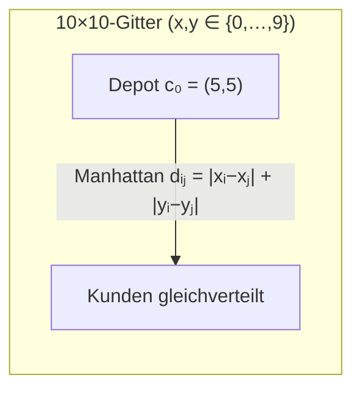
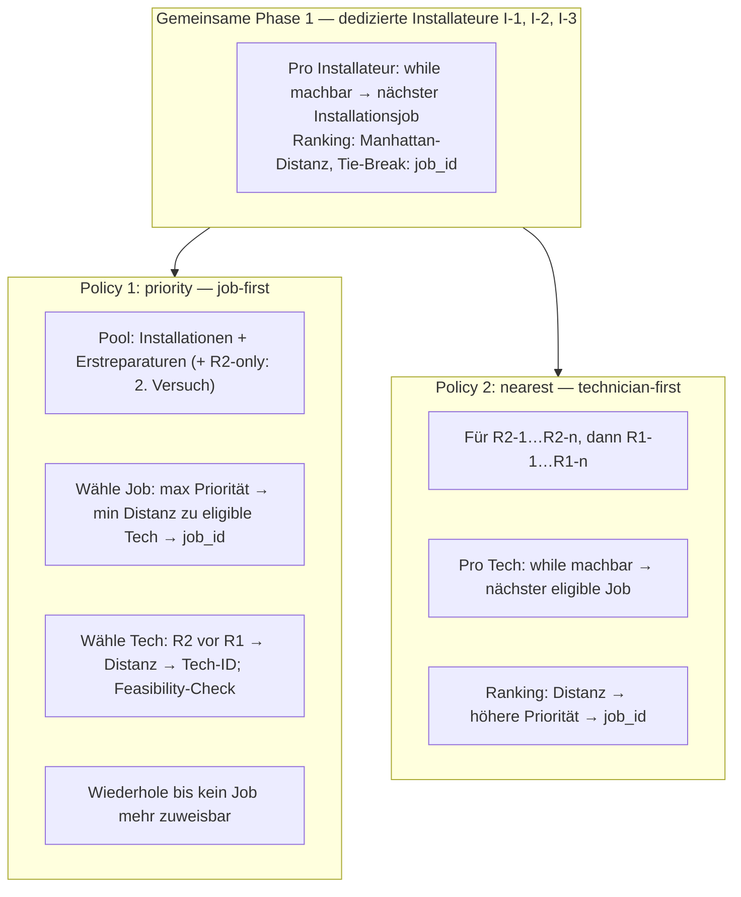
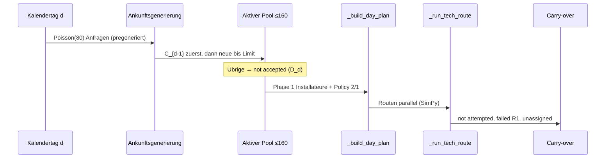
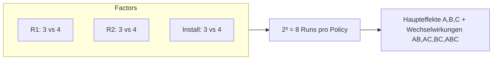

# SimProdLog — Project 2: Field Service Dispatching Simulation

> **Kurs:** Simulation in Production and Logistics (TUM)  
> **Deadline:** 20. Juli 2026, 11:59 Uhr (Moodle: `.ipynb` + Präsentation `.pdf`)  
> **Gruppeninfo bis:** 30.06.2026 an erdem.sahin@tum.de  
> **Präsentation:** 21.–22. Juli 2026, Raum L.4.41 (je 20 min + 5 min Fragen)

---

## Für AI-Agenten — Pflichtlektüre vor jeder Änderung

### Unveränderlicher Core-Code (absolut bindend)

Der Code in **`Project 2 Core Students.ipynb`** ist **vom Dozenten vorgegeben** und darf **weder von Menschen noch von AI-Agenten verändert werden**:

| Verboten | Erlaubt |
|----------|---------|
| Bestehende Zellen bearbeiten (Code **und** Markdown) | **Neue Zellen** am Ende des Notebooks hinzufügen |
| Zeilen umordnen, löschen oder einfügen innerhalb bestehender Zellen | Neue Hilfsfunktionen/Analysen in **eigenen** Zellen |
| Funktionssignaturen, Implementierungslogik oder Konstanten im Core ändern | Imports in neuen Zellen; Aufruf von `FieldServiceSim` mit anderen Parametern |
| Smoke-Test-Zelle anpassen | Visualisierungen, Experimente, Berichte in neuen Zellen |
| Kommentare in Core-Zellen ergänzen/ändern | Separate Dateien (`readme.md`, Präsentation, ggf. `analysis/`) |

**Auch die Position bestehender Zellen darf nicht verändert werden.** Das Notebook hat exakt **10 Zellen** in fester Reihenfolge (siehe [Notebook-Struktur](#notebook-struktur)).

### Arbeitsweise für Agenten

1. **PDF lesen:** `Project 2.pdf` ist die einzige normative Quelle für Modellannahmen und Aufgaben.
2. **Core unangetastet lassen:** Nur neue Zellen unterhalb des Smoke Tests.
3. **Reproduzierbarkeit:** Seeds dokumentieren (`seed`, `arrival_seed` in `FieldServiceSim`).
4. **KPIs exakt wie im PDF** berechnen und benennen (siehe [Leistungskennzahlen](#leistungskennzahlen-kpis)).
5. **Ergebnisse validieren:** Parameter im Notebook gegen PDF-Tabelle 1 und Formeln abgleichen.
6. **Keine Präsentation aus Code:** Präsentation ist separates PDF; Code wird dort nicht gezeigt.

### Was der Core **nicht** liefert (KPI-Sammlung in neuen Zellen)

`FieldServiceSim.run()` gibt **nur** die finale Carry-over-Liste zurück. Der Core protokolliert **keine** Tages-KPIs, keine abgeschlossenen Jobs, keine Reisezeiten und keine `not accepted`-Anfragen (die in `run()` verworfen werden: `accepted_jobs, _ = ...`).

**Konsequenz für Tasks 1–10:** In **neuen Zellen** eine Analyse-Schicht bauen, z. B.:

- **Subclass** von `FieldServiceSim` mit überschriebenem `run()` das tägliche Metriken sammelt, **oder**
- **Wrapper** der vor/nach jedem Tag Zustände ausliest, **ohne** Core-Methoden zu patchen.

Erlaubte Zusatzdaten pro Tag: \(Z_d\), \(D_d\), Carry-over mit Prioritäten, Job-Status-Histogramme, Techniker-Arbeitszeiten, Reisezeiten, Wartezeiten.

### RNG & Techniker-IDs

| Aspekt | Verhalten im Core |
|--------|-------------------|
| `seed` | Steuert Reise, Service, Reparatur-Ergebnis (`self.rng = default_rng(seed+1)`) |
| `arrival_seed` | Optional getrennt für Poisson-Ankünfte & Job-Generierung |
| Techniker-IDs | `R1-1…R1-n`, `R2-1…R2-n`, `I-1…I-n` (Reihenfolge in `tech_ids`) |
| Kalendertag | 1440 min zwischen Schichtbeginnen; Schicht = 480 min |

### Planung vs. Ausführung (häufiger Fehler)

| Prüfung | 20-min-Sicherheit | Return-Reserve |
|---------|-------------------|----------------|
| **Planung** (`_is_planning_feasible`) | **ja** (+20) | ja (E[T_j0]) |
| **Ausführung** (`_run_tech_route`) | **nein** | ja (E[T_j0]) |

### Schnellreferenz API (nur lesen, nicht ändern)

```python
# Baseline-Konstanten (Zelle 4)
MINUTES_PER_DAY = 480
DEPOT = (5, 5)          # Task 9: (3, 3)
ARRIVALS_PER_DAY = 80
NUM_R1, NUM_R2, NUM_INSTALL = 3, 3, 3
R1_SUCCESS_PROB = 0.90

# Simulation starten (neue Zelle)
sim = FieldServiceSim(
    policy='priority',   # oder 'nearest'
    seed=42,
    sim_days=100,
    arrivals_per_day=ARRIVALS_PER_DAY,
    p_repair=P_REPAIR,
    p_install=P_INSTALL,
    num_R1=NUM_R1, num_R2=NUM_R2, num_install=NUM_INSTALL,
    R1_success=R1_SUCCESS_PROB,
    depot=DEPOT,
    travel_base=TRAVEL_BASE_MIN,
    travel_low=TRAVEL_TRI_LOW, travel_mode=TRAVEL_TRI_MODE, travel_high=TRAVEL_TRI_HIGH,
    arrival_seed=None,   # optional: getrennte RNG für Ankünfte
)
carryover = sim.run()
```

---

## Problembeschreibung (Kurzfassung aus PDF)

Ein Haushaltsgeräte-Serviceunternehmen in **Heilbronn** betreibt ein **Field-Service-System**. Techniker starten am **Depot**, fahren zu Kunden (Reparatur/Installation) und kehren nach dem letzten versuchten Auftrag zurück. Die Tagesaufträge sind **vor der Routenplanung bekannt**.

### Servicegebiet & Reisezeit



| Größe | Formel / Wert |
|-------|----------------|
| Manhattan-Distanz | \(d_{ij} = \|x_i - x_j\| + \|y_i - y_j\|\) |
| Stochastische Zeit pro Einheit | \(\tilde{T}_{ij} \sim \text{Triangular}(5, 7.5, 12)\) |
| Reisezeit pro Streckenabschnitt | \(T_{ij} = 5 + d_{ij} \cdot \tilde{T}_{ij}\) (5 min Fix-Vorbereitung) |
| Erwartungswert | \(E[\tilde{T}_{ij}] = 8{,}1667\) → \(E[T_{ij}] = 5 + 8{,}1667 \cdot d_{ij}\) |

### Schicht, Planung & Ausführung

```mermaid
flowchart TD
    A[Tagesbeginn: alle Techniker am Depot, Rₖ = 480 min] --> B[Carry-over + neue Anfragen → aktiver Pool ≤ 160]
    B --> C[Routenplanung mit Erwartungswerten]
    C --> D{Planung machbar?}
    D -->|ja| E[Zuweisung; Rₖ −= E[Tᵢⱼ] + E[Sⱼₖ]]
    D -->|nein| F[Nicht zugewiesen → Carry-over]
    E --> G[Ausführung mit gesampelten Zeiten]
    G --> H{Shift-Check vor Job}
    H -->|ok| I[Job versucht]
    H -->|fail| J[Nicht versucht → Carry-over]
    I --> K{Reparatur R1 1. Versuch?}
    K -->|fail 10%| L[Fehlgeschlagener 1. Versuch → Carry-over]
    K -->|ok| M[Abgeschlossen]
```

**Planungs-Feasibility** (pro Kandidatenzuweisung):

\[
E[T_{ij}] + E[S_{jk}] + E[T_{j0}] + 20 \leq R_k
\]

- \(R_k\): verbleibende **geplante** Zeit des Technikers \(k\)
- **20 min** Sicherheitszuschlag (bleibt in der Feasibility-Prüfung reserviert)
- Nach Annahme: \(R_k\) wird nur um \(E[T_{ij}] + E[S_{jk}]\) reduziert

**Ausführung:** Prüfung vor jedem Job mit Erwartungswerten; tatsächliche Zeiten gestochastisch → **Überstunden möglich** (zählen zu Arbeitszeit & Auslastung).

### Nachfrage, Pool & Priorität

| Parameter | Wert |
|-----------|------|
| Tägliche Anfragen \|N_d\| | Poisson(80) |
| Installation / Reparatur | 60% / 40% |
| Aktiver Pool-Limit | 160 Jobs/Tag |
| Aufnahme neuer Anfragen A_d | \(\min\{|N_d|,\; \max(0,\; 160 - |C_{d-1}|)\}\) |
| Carry-over hat Vorrang | zuerst \(C_{d-1}\), dann neue in **Job-ID-Reihenfolge** |

**Priorität** \(p_{j,d}\): Installation neu = 0, Reparatur neu = 1; +1 pro ungelöstem Tag, max. 5.

### Techniker & Servicezeiten (Tabelle 1)

| Kombination | Gamma α | Gamma θ | E[S] | SD[S] |
|-------------|---------|---------|------|-------|
| Installation (alle Typen) | 16 | 1.5 | 24 min | √α·θ |
| Reparatur R1 | 4 | 5 | 20 min | |
| Reparatur R2 | 9 | 5/3 | 15 min | |

**Personal (Baseline):** 3× R1, 3× R2, 3× dedizierte Installateure.

| Typ | Installation | Reparatur 1. Versuch | Reparatur 2. Versuch |
|-----|--------------|----------------------|----------------------|
| Installateur | ✓ | ✗ | ✗ |
| R1 | ✓ | ✓ (90% Erfolg) | ✗ |
| R2 | ✓ | ✓ (immer Erfolg) | ✓ (nur 2. Versuch) |

**Carry-over am Tagesende:** nicht zugewiesen, nicht versucht, fehlgeschlagene R1-Erstreparaturen.

---

## Dispositionsrichtlinien (Policies)

Beide Policies teilen **Phase 1: dedizierte Installateure** (Techniker-ID-Reihenfolge, jeweils nächster machbarer Installationsjob, Tie-Break: Job-ID).

Danach: verbleibende Installationen + Erstreparaturen → R1/R2; Zweitversuch-Reparaturen → nur R2.





### Policy 1 — Priority

- **Job-first:** Route eines Technikers wird nicht komplett gefüllt, bevor andere berücksichtigt werden.
- Pro Schritt: höchste Priorität → bei Gleichstand nächster eligible R1/R2 → Job-ID.
- Techniker für gewählten Job: **R2 vor R1**, dann Distanz, dann Techniker-ID.

### Policy 2 — Nearest

- **Technician-first:** R2 (ID-Reihenfolge), dann R1; Route pro Techniker vollständig, bevor der nächste dran ist.
- Pro Techniker: nächster machbarer Job; Tie-Break: **höhere Priorität**, dann Job-ID.

---

## Leistungskennzahlen (KPIs)

### Täglicher Service-Penalty-Score

\[
Z_d = \sum_{j \in C_d} p_{j,d} + 5 \cdot D_d
\]

- \(C_d\): Carry-over am Tagesende  
- \(D_d\): nicht akzeptierte Anfragen (wegen 160er-Limit)  
- **Niedriger = besser**; Reisezeit **nicht** im Score

### Vergleichskriterien (beide Policies)

| KPI | Beschreibung |
|-----|----------------|
| Ø täglicher Service-Score | Mittelwert von \(Z_d\) über Simulationshorizont (nach Warm-up) |
| First-Time-Fix-Rate | Anteil erfolgreich abgeschlossener Reparaturen beim ersten Versuch |
| P(fehlgeschlagener 1. Reparaturversuch) | Wahrscheinlichkeit für Reparaturanfragen |
| Ø Reisezeit pro Technikertyp | getrennt nach Installateur / R1 / R2 |
| Auslastung pro Technikertyp | Arbeitszeit / Schichtlänge |
| Workload Balance | Ø absolute Abweichung von der täglichen Ø-Auslastung |
| Ø Kundenwartezeit | Anfrage bis erfolgreicher Abschluss |

### Job-Status (exakt einer pro Anfrage/Tag)

`completed` · `not accepted` · `not assigned` · `not attempted` · `failed first-attempt repair`

---

## Aufgaben (Tasks 1–10)

| # | Aufgabe | Methode / Hinweis |
|---|---------|-------------------|
| **1** | Warm-up-Länge & Simulationshorizont | z. B. Welch, MSER, Batch-Means; Konfidenzintervalle |
| **2** | Baseline-Performance beider Policies | alle KPIs aus Tabelle oben |
| **3** | P(fehlgeschlagener 1. R1-Versuch) | Schätzer + CI; mit Task 2 konsistent |
| **4** | **2^k-Faktoriell** Personal | Faktoren: R1, R2, Installateure (je Level: Basis vs. +1); Haupt- & Interaktionseffekte |
| **5** | **Vollfaktoriell 3³** | Faktoren: Ankunftsrate, Reisezeit-Bedingung, R1-Erfolgswahrscheinlichkeit (je 3 Level); alle KPIs; Policy-Vergleich über alle Kombinationen |
| **6** | Räumliche Verteilung | Heatmaps/Karten für *not assigned*, *not attempted*, *failed first-attempt repair*; Policy-Vergleich |
| **7** | Reisezeit & Service-Standort-Heatmaps | Ø Reisezeit pro Techniker; Erklärung Policy-Unterschiede |
| **8** | Arbeitszeiten & Fairness | Tägliche Arbeitszeiten; Ø abs. Abw. von Ø-Auslastung |
| **9** | Depot-Umzug **(3, 3)** | Bildungscampus; Baseline-Personal noch ausreichend? (beide Policies) |
| **10** | Management-Fazit | Policy-Empfehlung; Bedingungen für Priority vs. Nearest |

---

## Notebook-Struktur

| Zelle | Typ | Inhalt | Änderbar |
|-------|-----|--------|----------|
| 0 | Markdown | Titel & Einleitung | **Nein** |
| 1 | Markdown | §1 Überschrift | **Nein** |
| 2 | Markdown | Input Parameters Erklärung | **Nein** |
| 3 | Code | Konstanten & Parameter | **Nein** |
| 4 | Markdown | Helper Functions | **Nein** |
| 5 | Code | `make_job`, `priority_scalar`, `manhattan`, Travel/Service-Funktionen | **Nein** |
| 6 | Markdown | Main Simulation Module | **Nein** |
| 7 | Code | Klasse `FieldServiceSim` (komplett) | **Nein** |
| 8 | Markdown | Smoke Test | **Nein** |
| 9 | Code | 30-Tage-Smoke-Test beider Policies | **Nein** |
| **10+** | *neu* | Analysen, Tasks 1–10, Plots | **Ja** |

### `FieldServiceSim` — interne Methoden (Referenz)

`_generate_daily_arrivals`, `_limit_daily_arrivals`, `_eligible`, `_repair_technicians`, `_planning_times`, `_is_planning_feasible`, `_installation_candidates`, `_select_priority_job`, `_priority_technicians`, `_nearest_candidates`, `_build_day_plan`, `_run_tech_route`, `run`

---

## Experiment-Design (Leitfaden)

### Task 4 — 2^k Personal (k = 3)



### Task 5 — 3³ Operationsfaktoren

Typische Level (im Notebook begründen und mit PDF abstimmen):

| Faktor | Level 1 (low) | Level 2 (baseline) | Level 3 (high) |
|--------|---------------|--------------------|----------------|
| Ankunftsrate λ | z. B. 60 | 80 | 100 |
| Reisezeit | z. B. schneller (niedrigere Triangular-Parameter) | Baseline (5,7.5,12) | langsamer |
| R1-Erfolg | z. B. 0.80 | 0.90 | 0.95 |

→ **3³ = 27 Szenarien × 2 Policies**; gleicher Seed-Plan pro Szenario für fairen Vergleich.

### Task 1 — Warm-up & Horizont

- Mehrere Läufe mit steigendem `sim_days`; KPI-Zeitreihen auf Stationarität prüfen.
- Warm-up-Period von Metriken trennen; CIs berichten.
- Smoke Test (30 Tage) ist **kein** Ersatz für Task 1.

---

## Visualisierungen (empfohlen, in neuen Zellen)

| Task | Plot-Typ |
|------|----------|
| 2, 3 | Balkendiagramme Policy-Vergleich; CI-Fehlerbalken |
| 4, 5 | Haupteffekt- / Interaktionsplots; gegebenenfalls Response-Oberflächen |
| 6, 7 | 10×10-Heatmaps (`imshow`/`pcolormesh`) Job-Status & Service-Standorte |
| 7 | Reisezeit-Boxplots pro Technikertyp |
| 8 | Tagesarbeitszeiten; Auslastungsverteilung; Fairness-Metrik |
| 9 | KPI-Vergleich Depot (5,5) vs. (3,3) |

**Depot-Baseline vs. Task 9:**

```
Baseline (5,5):        Task 9 (3,3):
  0 1 2 3 4 5 6 7 8 9    0 1 2 3 4 5 6 7 8 9
0 . . . . . . . . . .  0 . . . . . . . . . .
1 . . . . . . . . . .  1 . . . . . . . . . .
2 . . . . . . . . . .  2 . . . . . . . . . .
3 . . . . . . . . . .  3 . . D . . . . . . .  ← neues Depot
4 . . . . . D . . . .  4 . . . . . . . . . .
5 . . . . . . . . . .  5 . . . . . . . . . .
...                    ...
      D = Depot
```

---

## Abgabe & Präsentation

- **Moodle:** Notebook (`.ipynb`) + Präsentation (`.pdf`)
- **Präsentation (20 min):** Problem & Policies · Methoden & Ergebnisse je Task · Empfehlung für Dispositionsmanager · **kein Code zeigen**
- **Gruppe:** max. 2 Personen; jede Person 10 min + gemeinsame 5 min Fragen
- **Slots:** 21.07. & 22.07., 10:00–12:30, L.4.41 (genauer Slot nach Deadline)

---

## Projektstruktur

```
SimProdLog-Project_2/
├── Project 2.pdf              # Offizielle Aufgabenstellung (Source of Truth)
├── Project 2 Core Students.ipynb   # Core-Simulation (READ-ONLY)
├── readme.md                  # Diese Datei — Agenten-Anleitung
└── (optional) analysis/       # Zusätzliche Skripte — nur wenn gewünscht
```

---

## Validierungs-Checkliste (gegen PDF)

- [x] 10×10-Gitter, Depot (5,5), Manhattan-Metrik
- [x] Triangular(5, 7.5, 12), E[T̃] = 8.1667, +5 min Fix
- [x] 480-min-Schicht, 20-min-Planungssicherheit
- [x] Poisson(80), 60/40 Install/Repair, Pool-Limit 160
- [x] Priorität 0/1, +1/Tag, max 5
- [x] Gamma-Parameter Tabelle 1
- [x] R1 90%, R2 immer, 2. Versuch nur R2
- [x] Policy 1 (Priority) & Policy 2 (Nearest) korrekt beschrieben
- [x] Z_d Formel & alle KPIs
- [x] Tasks 1–10 vollständig
- [x] Submission/Präsentation-Termine
- [x] Core-Notebook-Schutzregel dokumentiert
- [ ] Task-Lösungen im Notebook (noch offen — in neuen Zellen)
- [ ] Alle empfohlenen Plots erstellt (noch offen)

### Bekannte Core-Hinweise (nicht „reparieren“)

- Smoke-Test-Markdown sagt „three days“, der Code nutzt `sim_days=30` — **absichtlich im Core belassen**.
- `not accepted` Jobs werden im Core verworfen; für \(D_d\) muss die Analyse-Schicht die Differenz `generiert − aufgenommen` zählen.

*Letzte PDF-Abgleich-Iteration: 2026-06-29 (Initial + Verifikation Runde 1). Nächster Loop-Tick in 10 min.*

---

## Setup

```bash
python -m venv .venv
source .venv/bin/activate   # Windows: .venv\Scripts\activate
pip install simpy numpy matplotlib pandas scipy jupyter
jupyter notebook "Project 2 Core Students.ipynb"
```

Kernelspec im Notebook: `.venv` / Python 3.13.
